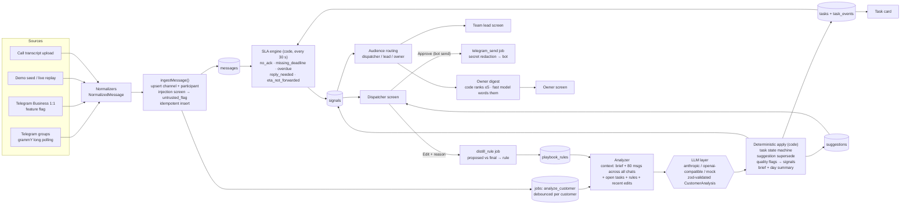

# Architecture

Victor AI is one repository with two processes sharing one Postgres database:

- **web** — Next.js 15 (App Router). Screens for Dispatcher, Team lead, Owner, Playbook, Sources,
  Settings, Demo control. Route handlers under `/api` for every mutation. All reads and writes go
  through the RBAC `guard()` and are scoped by `company_id`.
- **worker** — plain Node process (`src/worker/main.ts`). Runs the Telegram long-polling bridge
  (grammY), the job runner (`jobs` table, `FOR UPDATE SKIP LOCKED`) and the scheduler (SLA engine
  every 30 s, retention cleanup daily, demo replay ticks).

## Key flows

1. **Ingestion.** Every source produces a `NormalizedMessage`; `ingestMessage()` is the only writer
   of `messages`. It screens text for prompt injection (ported Iva gate), marks `untrusted_flag`,
   and enqueues `analyze_customer` (15 s debounce, 2 s in demo replay). Unmapped chats wait in
   Sources until the owner maps them to a customer and chat type.
2. **Analysis.** `analyze_customer` builds a merged timeline across all of the customer's channels
   (untrusted text wrapped in `<untrusted>`), calls the main model once, and applies the result in
   code. The LLM never writes to the DB directly and never triggers side effects.
3. **Task state machine.** Forward-only transitions (plus `cancelled`), evidence message must be in
   the context, `deadline_set` requires a parseable deadline, every change is a `task_events` row.
4. **SLA engine.** Pure function over tasks, messages and a clock → desired set of open signals;
   the DB layer opens new ones (dedupe key: kind + task/channel) and resolves the ones no longer
   true.
5. **Learning.** Edits create `distill_rule` jobs; rules are merged by similarity, active at
   customer scope, proposed at company scope. Active rules and the last 5 edits go into every
   analysis prompt; suggestions list the rule ids they used.
6. **Owner digest.** Code ranks open owner signals (severity × recency × watch-criteria match) and
   keeps ≤5; the fast model only words them.
7. **Outbound.** The only side effect is a human-approved bot send, executed by the worker after
   secret redaction.

## Multi-tenancy

Every table except `companies` has `company_id`; every query helper takes the session's
`companyId`. The guard derives it from the session, never from the request body.

## LLM providers

`src/lib/llm/` is the only door to models. `providers.ts` builds the chain from env: **Anthropic**
(only with `ANTHROPIC_API_KEY`) → **Cerebras** (`LLM_BASE_URL` + `LLM_API_KEY`) → **Google Gemini**
(`GEMINI_API_KEY`, OpenAI-compatible endpoint) → **mock** (deterministic EN/RU heuristics). Every
model variable accepts a failover list. A runtime switch in the demo room (`system_state.llm_mode`)
sends everything to the mock without a restart.

Per call (`index.ts`): demo cache lookup → for each provider and model: shared token bucket in
Postgres (`ratelimit.ts`) → `generateText` with strict `json_schema` (or `json_object` + schema in
the instructions if the model rejects it) → lenient JSON parse + zod → one repair attempt with the
validation error → on 429 / 5xx / timeout / invalid output: spaced retries, then the next model or
provider → every attempt logged in `analysis_runs` (`cached` marks cache hits). `pnpm eval`
(`scripts/eval.ts`) runs the Apex scenario through any model with the chain pinned
(`withLlmOverride`), see `docs/EVAL.md`.
